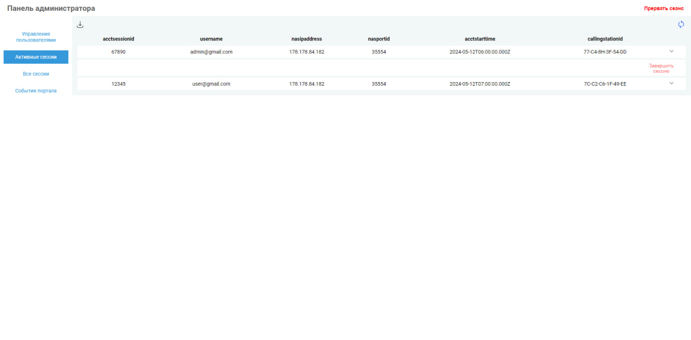

# Captive Portal

## Обзор
Проект Captive Portal был успешно протестирован на роутере с OpenWRT версии 23.05 и CoovaChilli, а также на операционной системе Debian 12.

## Используемые технологии
- FreeRADIUS версии 3.0
- PostgreSQL версии 15
- Nginx
- Frontend: HTML, CSS, JavaScript
- Backend: Node.js с фреймворком Express

## Установка
Для установки проекта выполните следующие шаги:
```bash
cd ~/
git clone git@github.com:Pavewleln/captive_portal.git
cd captive_portal/
chmod +x install.sh
./install.sh
```

Все необходимые зависимости установятся автоматически

## Схема БД:

### macs: 
Эта таблица обычно используется для хранения MAC-адресов устройств. Столбцы:
- `username`: имя пользователя, связанное с MAC-адресом.
- `callingstationid`: сам MAC-адрес устройства.

### nas: 
Содержит информацию о сетевых точках доступа (Network Access Servers). Используется для определения устройств, которые могут отправлять запросы на сервер RADIUS.
- `nasname`: Имя или IP-адрес NAS.
- `shortname`: Короткое имя NAS.
- `type`: Тип NAS (например, cisco, juniper и т.д.).
- `ports`: Количество портов на NAS.
- `secret`: Секрет для взаимодействия с NAS.
- `server`: Сервер, к которому NAS должен подключаться.
- `community`: SNMP community.
- `description`: Описание NAS.

### nasreload: 
Таблица, которая может использоваться для планирования перезагрузки NAS на основе определенных условий.
- `nas_id`: Идентификатор NAS, который должен быть перезагружен.
- `reload_event`: Событие или условие, при котором должна произойти перезагрузка.
- `reload_time`: Время, когда должна быть запланирована перезагрузка.
- `status`: Статус перезагрузки (например, запланирована, выполнена, отменена).

### radacct: 
Записывает данные учета для сессий, такие как время начала и окончания сессии, объем переданных данных и т.д.
- `radacctid`: Уникальный идентификатор записи учета.
- `acctsessionid`: Идентификатор сессии.
- `acctuniqueid`: Уникальный идентификатор для отслеживания сессий.
- `username`: Имя пользователя.
- `groupname`: Группа пользователя.
- `realm`: Область, к которой относится пользователь.
- `nasipaddress`: IP-адрес NAS.
- `nasportid`: Идентификатор порта на NAS.
- `nasporttype`: Тип порта на NAS.
- `acctstarttime`: Время начала сессии.
- `acctstoptime`: Время окончания сессии.
- `acctsessiontime`: Продолжительность сессии.
- `acctauthentic`: Метод аутентификации.
- `connectinfo_start`: Информация о подключении при начале сессии.
- `connectinfo_stop`: Информация о подключении при окончании сессии.
- `acctinputoctets`: Количество входящих октетов.
- `acctoutputoctets`: Количество исходящих октетов.
- `calledstationid`: Идентификатор вызываемой станции.
- `callingstationid`: Идентификатор вызывающей станции.
- `acctterminatecause`: Причина завершения сессии.
- `servicetype`: Тип услуги.
- `framedprotocol`: Протокол кадрирования.
- `framedipaddress`: IP-адрес, присвоенный пользователю.

### radcheck: 
Хранит список пользователей и их аутентификационные данные, например, пароли.
- `username`: Имя пользователя.
- `attribute`: Атрибут RADIUS.
- `op`: Оператор сравнения (например, ==, !=, >=).
- `value`: Значение атрибута.

### radgroupcheck: 
Определяет атрибуты для групп пользователей для проверки перед аутентификацией.
- `groupname`: Имя группы.
- `attribute`: Атрибут RADIUS.
- `op`: Оператор сравнения.
- `value`: Значение атрибута.

### radgroupreply: 
Определяет атрибуты для групп пользователей, которые должны быть применены после успешной аутентификации.
- `groupname`: Имя группы.
- `attribute`: Атрибут RADIUS.
- `op`: Оператор сравнения.
- `value`: Значение атрибута.

### radpostauth:
Записывает информацию о результатах попыток аутентификации после их выполнения.
- `username`: Имя пользователя.
- `pass`: Пароль.
- `reply`: Ответ сервера.
- `authdate`: Дата аутентификации.

### radreply: 
Содержит атрибуты, которые должны быть применены к пользователю после успешной аутентификации.
- `username`: Имя пользователя.
- `attribute`: Атрибут RADIUS.
- `op`: Оператор сравнения.
- `value`: Значение атрибута.

### radusergroup: 
Связывает пользователей с группами, к которым они принадлежат.
- `username`: Имя пользователя.
- `attribute`: Атрибут RADIUS.
- `op`: Оператор сравнения.
- `value`: Значение атрибута.

## Интерфейс администрирования:
Интерфейс администратора имеет следующие возможности:
- управление парами логин-пароль (просмотр/добавление/изменение/удаление)
- просмотр активных сессий клиентов с возможностью досрочно деавторизовать клиента
- просмотр всех сессий с фильтрами.
- просмотр всех сохранённых сообщений о событиях портала.
- выгрузка данных в форме отчёта JSON

### Управление пользователями


На странице «Управление пользователями», мы можем создавать новых пользователей, а также удалять и редактировать существующие записи. Также есть возможность экспортировать имеющиеся данные в формате JSON.
Чтобы создать запись необходимо нажать на кнопку “+”, после чего откроется окно для ввода информации о новом пользователе.


Чтобы удалить запись, необходимо развернуть дополнительную информацию о записи, нажав на стрелочку в конце записи, после чего выбрать кнопку «-». Мы увидим окно, где необходимо подтвердить удаление.


Для редактирования пользователя нужно в панели дополнительной информации о пользователе нажать на иконку редактирования. После чего мы увидим окно для редактирования данных о пользователе.


При нажатии на иконку «Экспорт», мы можем скачать файл в формате JSON со всеми данными о всех пользователях.


### Активные сессии

Чтобы остановить сессию, необходимо развернуть дополнительную информацию о пользователе и нажать на кнопку «Завершить сессию».



### Все сессии

При переходе на страницу «Все сессии», мы можем просмотреть информацию о всех сессиях, которые когда либо бы в данной сети. Здесь мы можем экспортировать всю необходимую информацию, а также отфильтровать ее, при необходимости.


### События портала

На странице событий портала мы можем увидеть историю авторизации в нашем портале

